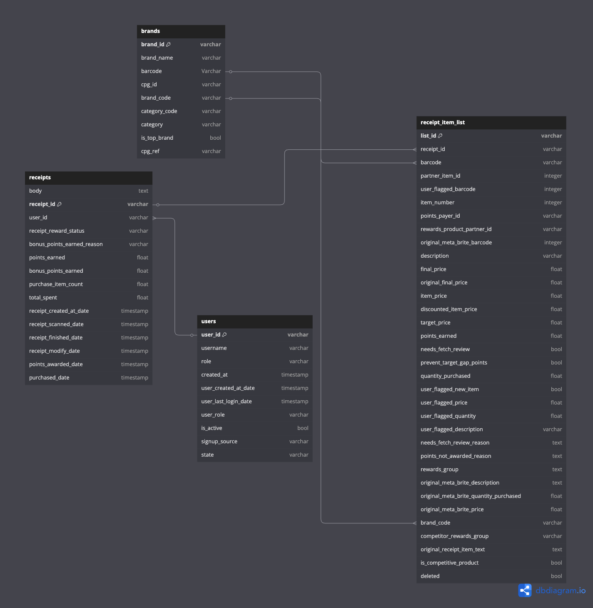

# Fetch Rewards Analysis
This is an repository contains my solutions on unstructured data to provide analysis on transactional receipt data, clean and validate multiple datasets and generate insights via Python and SQL. 

## Problem Statement
1. **Data Transformation:** Review unstructured json files (*brands.json*, *users.json*, *receipt.json*) and process/clean the datasets.
2. **Data Modeling:** Build a new structure relational data model and diagram.
3. **SQL Queries for Business Operations:** Answer related business questions from a business stakeholder via SQL.
4. **Data Quality Checks:** Explore and identify data quality issues and resolve inconsitencies if possible.
5. **Stakeholder Comunnication:** Generate insights from the data and address/ ask questions to the stakeholder.


## Data Transformation (Converting .json files to .csv)
Looking through the json files, there are nested fields within the tables that need to be unnested or cleaned and converted to a format that is readible into a database. 

I created a jupyter notebook python file: [to_csv.ipynb](./to_csv.ipynb) to clean and normalize these json files provided. I normalize the json files individually and export them to a .csv files. *(Note: you will need to comment out lines and put your file path to read in json files)*.

I perform some normalization of the nested fields and addresssed any field naming issues like lowercasing and taking *'$'* out. 

After reviewing the unstructured json files, I discovered there is a nested table in the receipts.json file that can be extracted separately into another table by itself from the *rewards_receipt_item_list field*.

Here are the exported .csv files that are cleaned:
- [Brands.csv](./brands.csv)
- [Users.csv](./users.csv)
- [Receipts.csv](./receipts.csv)
- [Receipt Items List.csv](./receipt_items_list.csv)


## Data Modeling (Creating Relational Data Model Diagram)

After transforming the jsons into a readable format, I am able to create a relational diagram on the tables based on primary and forien keys I have identified:

1.**Brands:**
- Primary Key: *brand_id*
- Foreign Keys: *brand_code* (This could be used as a joinable key but, it is not advised).
2. **Users:**
- Primary Key: *user_id*
3. **Receipts:**
- Primary Key: *receipt_id*   Foreign Keys: *user_id*
4. **Receipt Items List:**
- Primary Key: *list_id* (This is a created SKEY to create a unique key)
- Foreign Keys: *receipt_id*



Here is a link to the DBDiagram in more context: 

[Fetch Reward Data Model](https://dbdiagram.io/d/67d06dea75d75cc844b1f917)


## SQL Queries for Business Operations 
There were a couple of steps I need to make sure I was able to import the .csv files into SQL client *(I used Dbeaver)*.
- Install homebrew
- Create a postgres local database *(created a DEV Fetch Rewards Database)*.
- Import configure the .csv files into the *DEV* environment with the correct data types.
- Additional Cleaning  fields in the tables *(date fields, null values, creating skey, aggregations, etc.)*.
- Creating CTE's to querry the business operations question.

I deciede to answer these business questions:

**Which brand has the most spend among users who were created within the past 6 months?**

**Which brand has the most transactions among users who were created within the past 6 months?**

I was able to create a single querry that answers both of these questions here:

```sql
with users as (
	select 
		distinct
		"_id_oid" as user_id,
		TO_TIMESTAMP(createddate_date /1000) as user_created_at_date,
		TO_TIMESTAMP(lastlogin_date/1000) as user_last_login_date,
		role as user_role,
		active as is_active,
		signupsource as signup_source,
		state
	from users
),
brands as (
	select 
		_id_oid as brand_id,
		name as brand_name,
		barcode,
		cpg_id_oid as cpg_id,
		brandcode as brand_code,
		categorycode as category_code,
		category,
		topbrand as is_top_brand,
		cpg_ref
	from brands 
),
receipts as (
	select 								
		receipt_id,
		rewardsreceiptstatus as receipt_reward_status,
		bonuspointsearnedreason as bonus_points_earned_reason, 
		pointsearned as points_earned,
		bonuspointsearned as bonus_points_earned,
		purchaseditemcount as purchase_item_count, 
		totalspent as total_spent,
		TO_TIMESTAMP(createdate_date/1000) as receipt_created_at_date,
		TO_TIMESTAMP(datescanned_date/1000) as receipt_scanned_date,
		TO_TIMESTAMP(finisheddate_date/1000) as receipt_finished_date,
		TO_TIMESTAMP(modifydate_date/1000) as receipt_modify_date,
		TO_TIMESTAMP(pointsawardeddate_date/1000) as points_awarded_date,
		TO_TIMESTAMP(purchasedate_date/1000) as purchased_date,
		userid as user_id
	from receipts
),
receipt_items_list as (
	select 
		concat("partnerItemId",receipt_id) as list_id,
		receipt_id,
		barcode,
		"partnerItemId" as partner_item_id,
		"userFlaggedBarcode" as user_flagged_barcode,
		"itemNumber" as item_number,
		"pointsPayerId" as points_payer_id,
		"rewardsProductPartnerId" as rewards_product_partner_id,
		"originalMetaBriteBarcode" as original_meta_brite_barcode,
		description,
		"finalPrice" as final_price,
		"originalFinalPrice" as original_final_price,
		"itemPrice" as item_price,
		"discountedItemPrice" as discounted_item_price,
		"targetPrice" as target_price,
		"priceAfterCoupon" as price_after_coupon,
		"pointsEarned" as points_earned, 
		"needsFetchReview" as needs_fetch_review,
		"preventTargetGapPoints" as prevent_target_gap_points,
		"quantityPurchased" as quantity_purchased,
		"userFlaggedNewItem" as user_flagged_new_item,
		"userFlaggedPrice" as user_flagged_price,
		"userFlaggedQuantity" as user_flagged_quantity,
		"userFlaggedDescription" as user_flagged_description,
		"needsFetchReviewReason" as needs_fetch_review_reason,
		"pointsNotAwardedReason" as points_not_awarded_reason,
		"rewardsGroup" as rewards_group,
		"metabriteCampaignId" as meta_brite_campaign_id,
		"originalMetaBriteDescription" as original_meta_brite_description,
		"originalMetaBriteQuantityPurchased" as original_meta_brite_quantity_purchased,
		"originalMetaBriteItemPrice" as original_meta_brite_price,
		case 
			when length("brandCode") = 0 then null  -- Assigning empty values as nulls
			else "brandCode" 
		end as brand_code,
		"competitorRewardsGroup" as competitor_rewards_group,
		"originalReceiptItemText" as original_receipt_item_text,
		"competitiveProduct" as is_competitive_product,
		deleted
	from receipt_items_list
),
receipt_item_list_full as (
	select 
		irl.list_id, -- SKEY should be unique (A test so we do not get duplicated records)
		irl.receipt_id, -- FK
		coalesce(irl.brand_code,b.brand_name) as brand_code, -- Coalescing the Brancode and Brand name incase of NULL's
		r.receipt_scanned_date,
		irl.barcode,
		b.barcode,
		irl.final_price,
		irl.quantity_purchased,
		round(cast((irl.final_price * irl.quantity_purchased) as numeric),2) as total_final_price,
		u.user_id,
		u.user_created_at_date
	from receipt_items_list as irl 
	left join receipts as r on irl.receipt_id = r.receipt_id
	left join brands as b on irl.barcode = b.barcode::varchar -- Casting barcode from brands as Varchar for the join
	left join users as u on r.user_id = u.user_id
	--where u.user_created_at_date >= CURRENT_DATE - INTERVAL '6 months' THIS SHOWS NO RECORDS 
	where u.user_created_at_date >= '2021-03-01 16:17:34.000-07'::timestamp with time zone - INTERVAL '6 months' -- Hard Coded date assuming that the current month is March 2021 with Historical data
),
final as (
	select 
		brand_code as brand,
		sum(total_final_price) as total_spend,
		count(distinct receipt_id) as total_transactions -- each transaction is everytime a item is purchased on a receipt and has a reciept_id. 2 items purchesed on the same receipt are considerted 1 transaction.
	from receipt_item_list_full
	--where u.user_created_at_date >= CURRENT_DATE - INTERVAL '6 months' THIS SHOWS NO RECORDS 
	where user_created_at_date >= '2021-03-01 16:17:34.000-07'::timestamp with time zone - INTERVAL '6 months' -- Hard Coded date assuming that the current month is March 2021 with Historical data
	group by brand_code
	order by total_spend DESC
)
select * from final
```
Here is an example of the output of the SQL query:


## Data Quality Checks 
To ensure data integrety and exploration of the data quality, I performed the following data checks:
- **Incosistent Brand Names:** Comparing the brand name in the *Brands* and *Receipt Items List* table.
- **Checking Duplications (Uniqueness):** Checking for duplicates in each table. The Users table had duplicated records of *user_id*.
- **Invalid Entries:** Looking for nuances and weird data entries. In the *Brands* table the *brand_name* had *test* records
- **NULL Values:** Checking for NULL Values or missing values that could affect Joins between tables.
- **Join Testing:** Looking into joins between the *Brands* and *Receipt_items_list* table to see unmatched joins.
- **Unrealistic Negative Values:** Checking the price and quantity fields in the *Receipts_items_list* table for unrealistic values.
- **Extra Notes:** I created some SQL scripts to do some EDA and exploration on joins. 

Here is the SQL Queries that I have created to perform these checks:
[Data_quality_queries.sql](./data_quality_queries.sql)


## Stakeholder Communication (Slack Message or Email):

If I were to comunicate my findings and analysis of the datasets to buisness stakeholders who are non-technical, this is how I would construct my email:

Hello stakeholder, 

I hope you are doing well and enjoying your week! 
We wanted to follow up with my analysis on the Fetch Rewards data that you have assigned me to look into over.  we wanted to highlight and address a few key findings and questions to ensure we have accuracy and alignment on the data. 

**Key Findings and Questions** 
- **Impactful Data Quality Issues we have identified:**
We have found records in the *Receipts* and *Brand* table that are missing some key data points such as the *Brand Name, Barcode, and pricing fields* that impact reporting. There are also inconsistencies in the *Brand Name* (formatting, differences, missing values) and duplicated records. Additionally there are some duplicated identifiers in the *users* table that could lead to false reporting numbers.


- **How we identified these issues:** 
Durring our data exploratory analysis and data validation, we discovered missmatches when joining *Brands*, *Receipts*, and *Users* table together. There were anomalies in the *brand names, barcodes and pricing fields* that were flagged as inconsistencies. Additionally there were duplicated *users* when comparing to reference tables.


- **What we need in order to resolve this:**
	- We need to understand how frequently the data in the *Brands* table is populated and being updated and if there is our source of truth. Where is this data being sourced and are there other tables we could use.
 	- We need to align on how we are handling missing values. Should we keep these records, exclude, or flag these values in our reporting?
    - We need to confirm whether barcodes are unique to a specific brand and there are not multiple barcodes that reference the same brand.

-**How can we optimize our data for better insights and analysis:**
Having more cleaner/clearer brand and recipt data will give us a better leverage user spending behavior habits and insights as well as popular trending brands/items. Aligning on how we are consitently defining brand names and handling missing data can ensure better data quality within our reporting. 

--**

